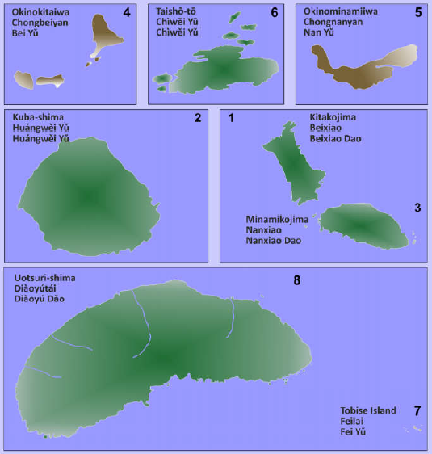

# Les Iles Senkaku : une dispute territoriale trinationale entre la Chine, le Japon et Taïwan

# Introduction

Parmi les disputes irrésolues qui persistent aujourd'hui sur la scène internationale, un certain nombre d'entre elles se trouvent en Asie de l'Est. L'une d'entre elles a la particularité de concerner 3 pays : la Chine, le Japon, et Taïwan, au sujet d'un archipel de petites iles a priori insignifiantes. Cette dispute, c'est celle concernant **les Iles Senkaku**, qui affiche régulièrement des incidents si ce n'est des crises.

# Présentation rapide des Iles Senkaku

Les Iles Senkaku, c'est d'abord un archipel composé de 5 iles de petite taille et de 3 ilots, dont une seule dépasse 1 km^2 et dont aucune n'est habitée. Elles se situent en Mer de Chine Orientale, au Nord de Taïwan. Au Sud et à l'Est des Senkaku se trouvent aussi deux autres groupes d'iles, qui sont elles habitées : les Iles Yaeyama à l'Ouest et les Iles Miyako à l'Est.
Tout comme ces deux autres groupes d'iles, l'Archipel des Senkaku est administré par le Japon et fait partie de la Préfecture d'Okinawa. Cet état de fait n'est toutefois pas accepté ni par la Chine, ni par Taïwan, qui revendique leur possession. Note amusante : la Chine avance en fait que les Senkaku font partie du territoire de Taïwan ; mais puisque du point de vue chinois, Taïwan fait partie de la Chine, les Senkaku en font mécaniquement aussi partie : une belle pirouette administrative.

<i>1ère carte : l'Archipel des Senkaku en lui-même. 
2ème carte : les différentes iles de l'Archipel.</i>

Les Senkaku disposent de trois noms officiels, selon le pays qui leur revendique sa souveraineté :
- Le Japon les appelle « l'Archipel Senkaku », soit en japonais : 尖閣諸島, Senkaku-shotō ; ou 尖閣群島, Senkaku-guntō ; ou encore 尖閣列島, Senkaku-rettō.
- La Chine les appelle « Iles Diaoyu », soit en chinois (simplifié) : 钓鱼岛, Diàoyúdǎo.
- Taïwan les appelle « Iles Diaoyutai », soit en chinois (traditionnel) : 釣魚臺列嶼, Diàoyútái liè yǔ.
On trouve aussi en chinois le nom « Diàoyútái Qúndǎo » (simplifié : 钓鱼台群岛 ; simplifié : traditionnel : 釣魚台群島). On peut également rencontrer le nom composé « Iles Senkaku-Diaoyu », ou le nom anglais « Iles Pinnacle ».

# Une brève Histoire des Senkaku : de l'acceptation à la contestation

C'est à la fin du XIXème siècle que les Iles Senkaku passent sous la houlette du Japon : ce dernier les annexe en même temps qu'il annexe l'ile de Taïwan et d'autres morceaux du territoire chinois par la signature du Traité de Shimonoseki (下関条約 Shimonoseki Jōyaku)[^1] en 1895, après que le Japon ait vaincu la Chine lors de la Première Guerre Sino-Japonaise. Le Japon conserve sa souveraineté sur le groupe d'iles jusqu'en 1945, fin de la Seconde Guerre Mondiale ; à ce moment, les iles passent sous le contrôle des États-Unis. Elles sont finalement rendues au Japon en 1972, avec le reste de la préfecture de Okinawa, selon l'Accord de Restitution d'Okinawa de 1971 {沖縄返還協定, Okinawahenkan kyōtei}.

Depuis leur restitution au Japon, les iles sont régulièrement revendiquées par la Chine et par Taïwan, causant des tensions constantes entre les pays concernés. Quand ils restent "diplomatiques", les arguments avancés prennent souvent appui sur des documents historiques ; sinon, les prétentions se manifestent de diverses manières in situ. Avant les années 2000, l'incident le plus notable a été la construction d'un phare par des Japonais en 1996, ce qui a été très mal perçu dans le monde chinois. La deuxième moitié des années 2000 semblait marquer un appaisement : les dirigeants de la Chine et du Japon avaient déclaré conjointement vouloir faire de la Mer de Chine Orientale une « Mer de Paix, de Coopération et d'Amitié »[^2] — bien qu'une crise diplomatique en 2010 vint tacher ses efforts. Par la suite, et notamment depuis l'arrivée au pouvoir de Xi Jinping en 2013, la Chine accroit ses incursions dans le secteur. Quand ce ne sont pas des bateaux de pêche chinois qui viennent y pêcher, ce sont des bateaux des gardes-côtes chinois qui, en étant vraisemblablement armés, viennent "patrouiller" ou déranger les bateaux de pêche japonais. En 2014, des activistes chinois ont même réussi à atteindre les iles. Par la suite, afin d'éviter une escalade, la Chine et le Japon se sont mis d'accord pour que la Chine empêche d'autres personnes d'essayer d'atteindre les iles, tandis que le Japon ne maintiendrait pas en détention de potentiels autres concernés et les renverrait directement en Chine : une politique qu'un rapport en anglais a appelé « deport-not-detain » (« expulser, pas détenir »).

<i>Vidéo montrant un navire des gardes-côtes chinois dans la zone des Senkaku, surveillé de près par des navires des gardes-côtes japonais</i>

# Une question de frontières et de sphères d'influence sous-jacente

À côté des considérations matérielles, les Senkaku représentent également un enjeu d'influence. Plus les frontières de son pays portent loin, plus l'influence du pays porte loin. Pour les pays concernés, c'est essentiel : la Chine et le Japon sont les deux États asiatiques les plus puissants et influents de la planète. Ils cherchent chacun à maintenir — ou à restaurer — leur sphère d'influence acquise au cours des siècles ou des décennies précédentes ; ce qui les conduit inévitablement à la concurrence, si ce n'est à la confrontation.

De plus, grâce aux conventions du Droit international sur la mer, le Japon possède non seulement les iles elles-mêmes, mais également une zone souveraine s'étendant à 12 milles marins (environ 22 km), ainsi qu'une zone supplémentaire, la fameuse ZEE (Zone Économique Exclusive, qui serait plus proprement abrégée ZÉE) étirant son territoire de 200 milles marins (environ 370 km) additionnels. En plus d'offrir au Japon un large territoire exploitable à son envie, cela rapproche largement la frontière japonaise de la frontière chinoise.
Or, avec la frontière japonaise se déploie également la frontière de son allié le plus notable : les États-Unis. D'autant qu'à travers le Traité de Coopération Mutuelle de 1960, ces derniers ont un pacte militaire avec les Japonais assurant la défense conjointe du territoire japonais. Les Iles Senkaku délimitent ainsi également une frontière militaire, une sorte de marche du bloc des États-Unis — dont une base importante se trouve d'ailleurs à proximité, sur l'ile principale d'Okinawa. Or, pour la Chine, côtoyer cette frontière est difficilement tolérable : Pékin cherche à préserver au maximum des frontières qui ne côtoieraient pas un pays allié aux États-Unis, ceci afin de maintenir de préserver une sorte de glacis de défense que Washington devrait pénétrer avant de toucher le cœur du territoire chinois.

Afin de sécuriser le périmètre des Senkaku, Tokyo renforce sa défense et sa présence dans la zone. Au niveau local, des patrouilles de gardes-côtes japonais ont régulièrement lieu. Bien qu'elle n'ait pas été un choix gouvernemental, la construction du phare en 1996 participait aussi de cette intention. Au niveau national, le budget de 2023 pour la Défense inclut une part pour améliorer le déploiement de troupes dans la zone sud-oueste du territoire japonais — soit là où se trouvent les Senkaku. L'année dernière, il a été également question de construire un nouveau navire de patrouille de dimension très importante, capable de contenir plusieurs autres plus petits bateaux. De manière générale, l'augmentation du budget militaire du Japon est en partie dûe aux disputes territoriales auxquelles le Japon fait face, dont celle des Senkaku.

# Un emplacement profitable stratégiquement

## Des ressources de différentes natures

L'Archipel des Senkaku et leur ZEE abritent des ressources de différents types. Il y a une faune et une flore exceptionnelles sur les iles, mais il s'agit davantage de patrimoine écologique que d'enjeux réels, lesquels concernent notamment : les ressources halieutiques, les hydrocarbures, et les terres rares.
- La zone des Senkaku est avant tout connue pour être une zone de pêche. On y trouve entre autres des poissons-limes noirs, des chinchards, et des maquereaux [^3]. Afin de réguler la pêche dans la zone, plusieurs conventions ont été signées entre les différents pays concernés (comprenant alors également la Corée du Sud). Toutefois, ces dernières années, à cause de la surpêche, la zone est devenue moins intéressante pour pêcher.
- Du pétrole aurait également été trouvé, et des installations off-shore ont été plusieurs fois envisagées. Toutefois, des études menées récemment dans la zone ont révélé que la quantité d'hydrocarbures réelle pourrait être bien inférieure à la quantité initialement convoitée.
- La dernière ressource est une ressource cruciale pour le monde contemporain : les terres rares. Cette ressource est aussi régulièrement mentionnée dans les conflits territoriaux en Mer de Chine Méridionale. Les terres rares sont des métaux nécessaires à la confection de plusieurs matériaux électroniques tels que les batteries ou les microprocesseurs. En-dehors des gisements à la surface, des gisements se trouveraient au sol des bas-fonds marins à plusieurs milliers de kilomètres sous la mer. En raison de l'infrastructure nécessaire à leur exploitation, ces gisements-ci ne sont pas actuellement considérés sérieusement, que ce soit pour l'Archipel des Senkaku ou ailleurs.

## Une route commerciale

Dans une certaine mesure, il s'agit également pour la Chine d'un enjeu commercial. Bien que la Chine mette en place une infrastructure importante pour contourner la façade du Pacifique (les fameuses Nouvelles Routes de la Soie), à l'heure actuelle elle exporte toujours la majorité de ses ressources via son littoral oriental. Dans ce contexte, circuler plus librement dans les eaux de la région lui permettrait d'exporter plus facilement ses marchandises, voire de contrôler davantage les flux commerciaux la traversant.

## Des considérations militaires

En-dehors des considérations mercantiles, les Senkaku sont également un bon atout militaire. Ainsi, les ressources potentiellement exploitables autour des Senkaku sont au final relativement secondaires. Comme l'affirme un un centre de recherche texan, les disputes qui les concernent ont donc un autre enjeu primaire représenté par ces iles : un enjeu stratégique. Le détendeur de la souveraineté sur les Iles Senkaku jouirait en effet d'une position stratégique intéressante dans le contexte géopolitique de la région. En raison de leur petite taille, les Iles Senkaku ne représentent qu'un faible intérêt au niveau de la défense ; elles offrent toutefois un intérêt certain en tant qu'avant-poste en amont de parties plus importantes du territoire japonais d'ailleurs habitées : l'archipel des Yaeyama ou des Miyako au Sud, ou encore mieux l'archipel d'Okinawa à l'Est.

## Chaque État y trouve son intérêt

Ainsi, chacun des États concernés y trouverait ses propres intérêts :
- Pour le Japon, contrôler ces iles lui permet d'étendre sa souveraineté et son influence bien au-delà de son archipel principal.
- Pour la Chine, les Iles Senkaku représentent le déverrouillage de la première chaine d'iles (constituée de plusieurs pays de la région este-asiatique) qui l'endiguent — et, par la suite, un accès au Pacifique facilité (mais non encore assuré).
- Pour Taïwan, il s'agit d'agrandir son territoire et son influence. Le pays insulaire a en effet besoin de davantage de force pour peser dans le bras-de-fer qui l'oppose à son rival continental.
- Et bien sûr, pour les US, il s'agit de restreindre la Chine en maintenant la première chaine d'iles  et par suite la politique d'endiguement de la Chine, reflet moderne de la politique du containment datant de la Guerre Froide qui visait à encercler l'URSS.

Intéressamment, les États-Unis évitent de prendre une position trop marquée sur la question de la souveraineté des iles, afin de ne pas trop se mêler de ce conflit qu'ils jugent périphérique à, sinon gênant pour leurs affaires ; d'autant plus quand de bonnes parties de celles-ci se font avec les 3 pays concernés…

# Conclusion

Ainsi, les îles Sekaku sont le reflet des tensions croissantes dans la région, en premier lieu celles mêlant la Chine et ses voisins. Depuis quelques décennies, les disputes surviennent régulièrement, battant la mesure du réarmement régional. Ces disputes sont d'un genre particulier : ne concernant pas des ressources, elles représentent avant tout la volonté pour les pays concernés d'affirmer leur souveraineté face à leurs voisins. Ces pays étant parmi les plus significatifs de la région (si ce n'est du monde), les incidents autour de l'Archipel des Senkaku fournissent une bonne mesure de la tension géopolitique dans la région.

---

# Quelques sources pour aller plus loin

- Pamment et al., 『The 2010 Senkaku crisis』, NATO StratCom COE, 205 pages.
- Lin (Enru), 『Local, Japan vessels clash off Diaoyutais』, The China Post, 26 septembre 2012 à 12:03 AM TWN. URL : < [https://web.archive.org/web/20150620160935/http://chinapost.com.tw/taiwan/national/national-news/2012/09/26/355552/Local-Japan.htm](https://web.archive.org/web/20150620160935/http://chinapost.com.tw/taiwan/national/national-news/2012/09/26/355552/Local-Japan.htm) >.
- Kosuke (Takahashi), 『China Sets Record for Activity Near Senkaku/Diaoyu Islands in 2023』, The Diplomat, 04 janvier 2024. URL : < [https://thediplomat.com/2024/01/china-sets-record-for-activity-near-senkaku-diaoyu-islands-in-2023/](https://thediplomat.com/2024/01/china-sets-record-for-activity-near-senkaku-diaoyu-islands-in-2023/) >.
- Verneuil (Christophe), Verneuil (Soraya), 『Japon et Chine – concurrences régionales, ambitions mondiales』, Paris : Éditions Ellipses, 2012, 155 pages notées.
- 『Traité de coopération mutuelle et de sécurité entre les États-Unis et le Japon』, signé le 19 janvier 1960.
- Source des cartes : http://www.geo-ref.net/de/xsn.htm
- Source de la vidéo : https://ipdefenseforum.com/2024/05/japan-boosts-maritime-defenses-amid-prcs-senkaku-islands-coercion/

[^1]: Le Traité de Shimonoseki est aussi connu en japonais comme « le Traité de Bakan » (馬關條約, Bakan Jōyaku), ou en chinois comme « le Traité de Maguan » (馬關條約, Mǎguān Tiáoyuē).
[^2]: Rapport du NATO StratCom COE mentionné dans les sources, où le texte en anglais est : « Sea of Peace, Cooperation and Friendship ».
[^3]: Ces poissons-là en particulier ont été énoncés dans un rapport à propos de l'activité de pêche autour des Senkaku ; le texte en anglais mentionne : « black scraper, horse mackerel, mackerel ».
