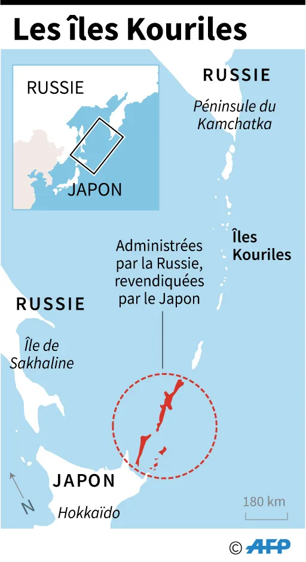

# Les Kouriles Méridionales : un enjeu périphérique et central

# Introduction

Il compte parmi les lieux géopolitiques les plus surveillés[^1]. Il fait partie des enjeux maritimes les plus importants du Pacifique. Il gêne les relations entre le Japon et la Russie depuis des décennies. Ce « il », c'est le contentieux des Iles Kouriles Méridionales : une dispute au sujet de la souveraineté sur un ensemble d'iles situées entre le Japon et la Russie, à la périphérie de leur territoire respectif.

Localisation des Kouriles Méridionales.

---
# Présentation des iles : isolées mais riches en ressources

Les Kouriles Méridionales, comme l'indique leur nom, font partie de l'Archipel des Kouriles : une chaine d'iles s'étendant sur 1 176 km de la Péninsule du Kamtchatka à l'Ile de Hokkaïdo — soit, de la Russie au Japon. Cet archipel sépare l'Océan Pacifique de la Mer d'Okhotsk. L'ensemble, volcanique, est assez montagneux et ses côtes relativement accidentées.

Administratativement, les Kouriles Méridionales font partie de l'Oblast de Sakhaline, qui comprend l'Ile de Sakhaline à l'Ouest et l'entièreté de l'Archipel des Kouriles à l'Est. Géographiquement, elles peuvent se décomposer en 4 parties : 3 iles de bonne taille qui sont habitées, auxquelles s'ajoutent 1 groupe d'ilots inhabités.

| Nom russe           | Nom japonais         | Superficie | Nombre d'habitants |
| ------------------- | -------------------- | ---------- | ------------------ |
| Итуруп (Iturup)     | 択捉島 (Etorofu-tō)     | 3 238 km^2 | 7 000 habitants    |
| Кунашир (Kounachir) | 国後島 (Kunashiri-tō)   | 1 550 km^2 | 4 000 habitants    |
| Шикотан (Chikotan)  | 色丹島 (Shikotan-tō)    | 182 km^2   | 1 500 habitants    |
| Хабомай (Habomaï)   | 歯舞諸島 (Habomai-shotō) | /           | inhabitées         |
En outre, Chikotan et les Iles Habomai font partie d'un sous-ensemble appelées « Petites Kouriles ».

Localisation et carte des Kouriles Méridionales.

Suffisamment grandes pour la plupart, les Kouriles Méridionales sont habitées par plusieurs milliers de personnes. Ethniquement, ces dernières sont avant tout des Russes ; on trouve également plusieurs autres ethnies et nationalités, parmi lesquelles des Ukrainiens, des Coréens, et des Aïnous. Les infrastructures sont plutôt limitées.

Les Kouriles Méridionales abritent plusieurs ressources, dont la plupart sont en exploitation.
La plus importante, c'est évidemment la pêche. Deux espèces ressortent particulièrement : le crabe et le saumon.
Des ressources minières sont également présentes, en premier lieu du rhénium (utilisé notamment dans la fabrication des moteurs d'avions supersoniques).
Il a été fait mention de gisements de gaz et de pétrole, mais cela reste des estimations et il n'y en a pas encore en exploitation.
Il existe également une petite exploitation forestière locale, ainsi qu'une faible activité touristique.

# Un contentieux qui perdure malgré des discussions récurrentes

## Bref historique des Kouriles Méridionales

En 1855, le Traité de Shimoda accorde la souveraineté des Kouriles Méridionales au Japon. Plus tard en 1875, un nouveau traité lui accorde l'entièreté de l'Archipel des Kouriles. Une population japonaise s'y installe petit à petit, remplaçant ou assimilant les habitants locaux qu'étaient les Aïnous. En Aout 1945, l'URSS déclare la guerre au Japon et envahit l'Archipel des Kouriles, arrivant à la frontière de l'Ile de Hokkaïdo ; l'archipel est ensuite annexé à l'Union. Après l'annexion, la population japonaise est déportée en Asie Centrale ; elle se fait remplacer par diverses populations venant de l'URSS.

L'annexion de l'URSS, unilatérale, n'est reconnue par le Japon. Durant toute la Guerre Froide, des discussions ont donc lieu périodiquement entre les deux pays afin de régler ce litige territorial ; ces discussions restent sans succès pendant toute la période.

Après la fin de la Guerre Froide, la Russie remplace l'URSS dans cette partie-là du monde. Autant le Japon que la Russie cherchent à faire pencher la balance de leur côté de diverses manières. À un moment, le gouvernement japonais propose d'offrir des aides financières aux Kouriles Méridionales pour favoriser leur développement. En 2006, le Président russe Poutine offre de rendre au Japon Chikotan et les Iles Habomai.

Des accords sont même parfois conclus entre les deux pays. Parmi ceux-là, on trouve la libre-circulation au sein des Kouriles Méridionales, ainsi qu'une permission accordée aux pêcheurs japonais de pêcher dans la zone. Des signes de résolution du contentieux apparaissent : en 2016, le Président russe Poutine, en qualifiant la situation de « anachronique », annonçait un règlement prochain du litige et la signature d'un traité de paix.

Toutefois, en raison de tensions récurrentes, ces accords perdurent peu ou prou. En 2006, lors d'une confrontation avec les gardes-côtes russes, un pêcheur japonais perd la vie. Provocatrices, des incursions d'avions russes dans l'espace aérien japonais ont lieu en 2008 et en 2013. En 2010, le Président russe Dmitri Medvedev visite Kounachir, ce que le Premier Ministre japonais d'alors, Naoto Kan, qualifie de « inadmissible grossièreté » ; 1 an plus tard, le Président russe renforce la présence militaire sur les iles en déployant des missiles antiaériens. En 2019, des pêcheurs japonais sont arrêtés par les gardes-frontières russes. Enfin, suite au déclenchement de la Guerre en Ukraine en 2022 et aux sanctions occidentales contre la Russie auxquelles le Japon a participé, le Président Poutine décide de suspendre les négociations.

## Le fond légal de la contestation

Le principal problème du contentieux des Kouriles Méridionales, c'est qu'il n'y a pas de délimitation des frontières officielle. Cela provient principalement de ce qu'à l'heure actuelle, le Japon et la Russie n'ont toujours pas signé de traité de paix depuis la fin de la Seconde Guerre Mondiale (ils ont toutefois signé un cessez-le-feu dans les années 1966). Or, ce serait par ce traité bilatéral entre les deux pays que les tensions cesseraient, puisqu'il définirait clairement les frontières entre les deux pays selon un accord approuvé par les deux parties.

En raison du non-règlement des hostilités, d'un point de vue juridique, les iles sont encore considérées comme étant un territoire japonais sous occupation russe.

En raison de la zone grise dans laquelle se trouvent les Kourilse Méridionales, les deux pays se basent sur les déclarations de leurs politiciens respectifs, ainsi que sur les différents traités conclus entre eux pour appuyer leurs revendications. Trois traités sont généralement invoqués : le Traité de Shimoda de 1855, les Accords de Yalta de 1945 et le Traité de San Francisco de 1951.

Pour le Traité de Shimoda de 1855, son article 2 dispose :
>« À l'avenir, la frontière entre les deux pays passera entre les îles d'Itouroup et d'Ouroup. L'île d'Itouroup appartient tout entière au Japon et les îles Kouriles situées plus au nord, y compris Ouroup, appartiennent à la Russie. »

Le Traité de Shimoda penche du côté du Japon, puisqu'il avance exactement ce qu'avance le gouvernement japonais : la cession des Kouriles Méridionales dans leur entièreté.

Pour les Accords de Yalta de Février 1945, il est déclaré que :
>« Les dirigeants des trois grandes puissances — l'Union soviétique, les États-Unis d'Amérique et la Grande-Bretagne — conviennent que deux ou trois mois après que l'Allemagne aura capitulé et que la guerre en Europe sera terminée, l'Union soviétique entrera en guerre contre le Japon aux côtés des Alliés, à condition que : \[…] 3. Les îles Kouriles seront transférées à l'Union soviétique. »

Au contraire du Traité de Shimoda, les Accords de Yalta vont là où veut aller la Russie : la cession desdites Kouriles pour la Russie. Toutefois, le principal problème des Accords de Yalta, c'est qu'ils ne sont pas bilatéraux : si (en tant qu'URSS) la Russie les avait bien acceptés, ce n'est pas le cas du Japon.

Quant au Traité de San Francisco de 1951, son article (2c) stipule :
>Le Japon renonce à tous droits, titres et revendications sur les îles Kouriles et à la partie Sud de Sakhaline et les îles qui lui sont adjacentes sur lesquelles le Japon a acquis la souveraineté comme conséquence du traité de Portsmouth du 5 septembre 1905.

Ce traité-là, en faveur de la Russie, est toqué du côté japonais par un argument géographique : les Kouriles Méridionales feraient partie de l'Ile de Hokkaïdo, et donc ne sont pas foncièrement incluses dans « les îles Kouriles ».

Le Japon appuie aussi ses revendications à partir des droits des anciens habitants des Kouriles. Subventionnées par le gouvernement, des associations japonaises militent pour le retour des iles dans le giron japonais.
À l'extérieur, Tokyo bénéficie également du soutien d'autres pays. Le principal a été les États-Unis, bien qu'ils aient surtout insisté pour dire que les Accords de Yalta ne constituaient pas une revendication valable de la part de la Russie et qu'il fallait que celle-ci trouve un accord à l'amiable avec le Japon. D'autre part, les pays de l'UE ont également apporté son soutien au Japon en déclarant la revendication japonaise comme légitime en 2005.

### L'émergence d'une tierce revendication : les droits ancestraux des Aïnous

Parallèlement aux Japonais et aux Russes, un autre peuple se soucie du sort des Kouriles Méridionales et les réclame : les Aïnous. Ils justifient leur revendication par le fait qu'ils occupaient ces iles avant les Japonais ou les Russes.

Les Aïnous interviennent de temps en temps pour manifester leur position. En 1992, un Aïnou japonais était intervenu lors d'une réunion japono-russe à propos du litige territorial pour manifester la place de son peuple dans la question. Dans la même veine, quelques années plus tard, en 2004, des Aïnous de nationalité russe (vivant dans la région voisine du Kamtchatka) ont contacté leur Président, à l'époque Vladimir Poutine, en lui demandant notamment de ne pas répondre aux revendications japonaises concernant les Kouriles.[^2]

Bien qu'elle ait peu de chances d'aboutir, la revendication aïnoue rencontre un écho parmi les autres revendications de même aloi émergeant de plus en plus ces dernières années de la part d'autres peuples autochtones de par le monde, comme dans les Amériques ou en Australie.

### Les issues possibles du contentieux

Tout ceci considéré, **quatre issues** au litige territorial des Kouriles Méridionales sont envisageables :
1. La première, ce serait le statu quo : que les Kouriles Méridionales restent russes.
2. La deuxième, ce serait le transfert de souveraineté au Japon : qu'elles deviennent japonaises.
3. La troisième, ce serait un compromis : les deux iles les plus au Sud, les susmentionnées « Petites Kouriles », deviennent japonaises, tandis que les deux les plus au Nord restent russes. Cette issue-ci a été régulièrement proposée par la Russie (et l'URSS en son temps).
4. Une quatrième serait une cogestion des territoires concernés (ce qui a très peu de chances d'arriver, une telle chose étant rare de base).

# L'importance géopolitique des Kouriles Méridionales

Tout ceci étant dit, pourquoi le Japon et la Russie n'arrivent-ils pas à se mettre d'accord sur une issue à ce litige ? Autrement dit, pourquoi cherchent-ils tous deux à contrôler entièrement les Kouriles Méridionales ? C'est qu'en plus des ressources mentionnées plus haut, d'autres considérations sont en jeu pour chaque pays.

## Des enjeux stratégiques et sécuritaires

Pour le Japon, l'enjeu est avant tout sécuritaire. La plus proche des iles russes, faisant partie du groupe des Iles Habomai, se trouve à à peine 4 km du Cap Nosappu, extrémité nord-este des côtes japonaises. En raison de cette proximité, l'occupation des Kouriles Méridionales par une puissance étrangère, qui plus est plutôt belliqueuse et hésitant peu à utiliser la force armée, représente une menace constante pour le Japon.

À l'opposé, le principal enjeu pour la Russie est stratégique. Juste au Nord de celles-ci, entre la pointe de l'ile la plus au Nord Itouroup et la prochaine ile plus au Nord Ouroup, se trouve le Détroit de Vries (Пролив Фриза, Proliv Friza). Il s'agit d'un passage maritime qui ne gèle pas en Hiver, soit un passage essentiel pour que la flotte russe du Pacifique, stationnée de l'autre côté de la Mer d'Okhotsk dans la ville de Vladivostok, puisse accéder librement à l'océan pour laquelle elle est prévue. Or, si le Japon reprenait le contrôle de l'autre côté du détroit, il pourrait gêner le passage de la flotte de guerre russe, notamment sous pression de son allié états-unien.

## Une part de politique intérieure

En-dehors des ressources et des enjeux évoqués ci-dessus, les Kouriles Méridionales ont également quelque importance dans la politique intérieure du Japon et de la Russie.

### Du côté japonais : une revendication gouvernementale avant tout, soutenue à l'extérieur

Si, de manière générale, la population japonaise ne s'intéresse pas à la question, le gouvernement japonais s'y intéresse bien pour sa part. Afin de palier au désintérêt de son peuple, le gouvernement met en œuvre des campagnes insistant sur le caractère japonais de ces iles. Il appelle ces iles « les Territoires du Nord » (北方領土, Hoppō Ryōdo), et les rattache administrativement les Kouriles Méridionales à la Sous-Préfecture de Nemuro (根室振興局, Nemuro-shinkō-kyoku), au sein de la Préfecture de Hokkaïdo (北海道, Hokkai-dō). Depuis le 16 juillet 2008, les manuels scolaires japonais indiquent que les Kouriles Méridionales sont japonaises. Des sorties scolaires sont organisées à proximité afin d'enseigner aux élèves le sort géopolitique de ces iles en défaveur du Japon. Sur les lieux mêmes, des monuments sont érigés rappelant la souveraineté japonaise des Kouriles Méridionales.
Cet effort de sensibilisation apparait également dans la culture populaire japonaise. Alors que je regardais un animé japonais, j'ai remarqué qu'une carte du Japon incluait les Kouriles Méridionales :

Carte du Japon dans 『\[C] - The Money of Soul and Possibility Control』.

Je ne sais pas à quel point cette carte-là peut se lier aux positions du gouvernement japonais, mais elle rappelle à coup sûr les cartes diffusées dans les œuvres chinoises qui font passer sous la juridiction de Pékin plusieurs territoires également en proie à des contentieux avec d'autres pays (tels que les Iles Spratleys).
Bien que la sensibilisation auprès du peuple japonais ne rencontre pas forcément un grand écho, la prise de position en faveur des Kouriles peut tout de même constituer un enjeu électoral, car elle favorise des affinités avec les cercles conservateurs ou réactionnaires japonais, lesquels ont une certaine emprise sur la vie politique du pays.

### Du côté russe : un peuple fier de ses acquis

Du côté de la Russie, en plus de l'aspect stratégique, les Kouriles Méridionales ont également un petit poids politique. Gagnées suite à la Seconde Guerre Mondiale, ces iles sont une source de fierté pour les Russes. Elles matérialisent une sorte de récompense pour les efforts dispendieux fournis par leur pays lors de la guerre. Ainsi, selon des sondages, la population russe est largement défavorable au retour des Kouriles dans le giron japonais : un sondage encore récent montrait que trois quarts des Russes étaient défavorables à leur cession. Au moins en partie, les politiciens russes doivent tenir compte de cette opinion populaire pour ne pas se mettre leur peuple à dos.

---
# Conclusion

Durant depuis 80 ans, le contentieux des Kouriles Méridionales ne semble pas près de trouver une conclusion. Bien que des discussions aient lieu à intervalles réguliers à leur sujet, aucune n'aboutit sur une issue convenant aux deux parties.

Du point de vue légal, plusieurs arguments sont invoqués de chaque côté, s'appuyant sur divers documents et déclarations. Parmi ceux-ci, deux traités souvent invoqués et des plus légitimes car signés par les deux parties, penchent chacun d'un côté différent, ce qui ne convient au final à aucun des deux — sans compter la revendication aïnoue, marginale mais bien présente.
Si les ressources exploitables dans la zone ont leur importance, les Kouriles Méridionales mêlent également d'autres enjeux de politique intérieure et extérieure. Pour le Japon, il s'agit d'acquérir un levier d'influence sur la Russie et d'accroitre, bien que les Japonais en général ne s'intéressent pas à la question à son grand désarroi. C'est tout le contraire des Russes, largement défavorables à un abandon des Kouriles en raison de la mémoire pour la Seconde Guerre Mondiale : ce qui arrange bien le gouvernement russe, pour lequel il est primordial de contrôler au maximum la Mer d'Okhotsk et de garantir l'accès au Pacifique. Choses que les États-Unis savent bien, raison pour laquelle ils soutiennent la revendication japonaise dans son expansion maximale.

Si la fin de la Guerre en Ukraine pourrait éventuellement renouer un dialogue plus fructueux entre le Japon et la Russie, rien ne garantit qu'il y sera question des Kouriles Méridionales ; et même si cela avait lieu, on peut être sûr que la zone resterait sous surveillance étroite des radars géopolitiques en raison de son importance stratégique.

---
# Notes

[^1]: Gauchon (Pascal) (dir.), Les 100 lieux de la géopolitique. (7e éd.). Presses Universitaires de France.
[^2]: On peut noter la différence de vision avec la revendication des Aïnous japonais, qui elle était neutre par rapport aux deux pays, tandis que la revendication des Aïnous russes est en faveur des Russes.

# Sources pour aller plus loin

- [La page Wikipédia concernée](https://fr.wikipedia.org/w/index.php?title=Contentieux_relatif_aux_%C3%AEles_Kouriles&oldid=221215119), qui fournit un bon résumé des enjeux et positions du contentieux.
- Terry McCarthy, Ainu people lay ancient claim to Kurile Islands: The hunters and fishers who lost their land to the Russians and Japanese are gaining the confidence to demand their rights, reports Terry McCarthy, The Independent, 21 septembre 1992 (URL : https://www.independent.co.uk/news/world/ainu-people-lay-ancient-claim-to-kurile-islands-the-hunters-and-fishers-who-lost-their-land-to-the-russians-and-japanese-are-gaining-the-confidence-to-demand-their-rights-reports-terry-mccarthy-1552879.html).
- Jin-Mieung Li, La question territoriale dans les relations internationales en Asie du Nord-Est, Hérodote, n° 141, La Découverte, 2e trimestre 2011.
- Traité de San Francisco de 1951.
